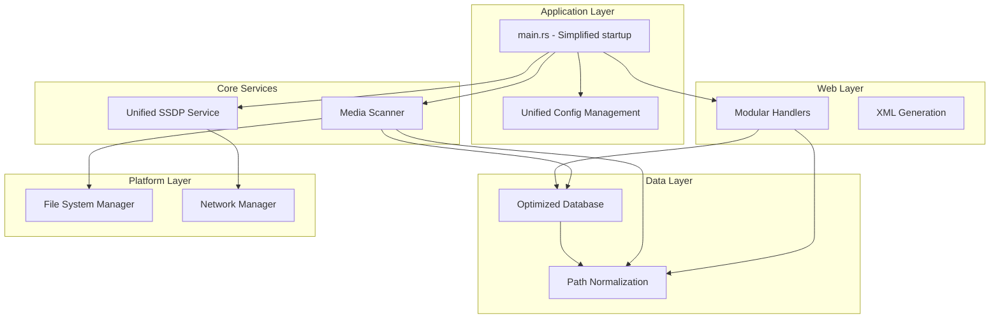

# Design Document

## Overview

This design addresses critical architectural issues in the media server codebase through a systematic refactoring approach. The solution focuses on establishing a unified path normalization system, eliminating performance bottlenecks, removing code duplication, and creating a more maintainable architecture.

The refactoring is structured in four phases to minimize risk and ensure incremental progress:
1. **Path Normalization Foundation** - Establish canonical path handling
2. **Database Optimization** - Fix performance bottlenecks and inefficient queries  
3. **Code Consolidation** - Eliminate duplication and remove unused code
4. **Architecture Improvements** - Enhance modularity and configuration handling

## Architecture

### Current Architecture Analysis

The application follows a layered architecture with these key components:
- **Platform Abstraction Layer**: Cross-platform file system and network operations
- **Database Layer**: SQLite-based media file storage and querying
- **Media Scanner**: File system scanning and metadata extraction
- **Web Layer**: DLNA/UPnP HTTP handlers and XML generation
- **SSDP Service**: Network discovery and announcement

### Target Architecture Improvements



## Components and Interfaces

### 1. Path Normalization System

**Core Component**: `PathNormalizer` trait and implementations

```rust
pub trait PathNormalizer: Send + Sync {
    /// Convert any path to canonical database format
    fn to_canonical(&self, path: &Path) -> Result<String, PathError>;
    
    /// Convert canonical format back to platform path
    fn from_canonical(&self, canonical: &str) -> Result<PathBuf, PathError>;
    
    /// Normalize path for database queries
    fn normalize_for_query(&self, path: &Path) -> Result<String, PathError>;
}
```

**Canonical Format Standard**:
- Lowercase absolute paths
- Forward slashes (/) as separators
- No trailing slashes except for root
- Example: `c:/users/media/videos/movie.mp4`

**Integration Points**:
- `MediaScanner::scan_directory_recursive()` - Apply before database storage
- `DatabaseManager::get_directory_listing()` - Apply to query parameters
- `content_directory_control()` - Apply to ObjectID-derived paths

### 2. Optimized Database Layer

**Enhanced DatabaseManager Interface**:

```rust
#[async_trait]
pub trait DatabaseManager: Send + Sync {
    // Existing methods...
    
    // New optimized methods
    async fn get_files_with_path_prefix(&self, prefix: &str) -> Result<Vec<MediaFile>>;
    async fn get_direct_subdirectories(&self, parent_path: &str) -> Result<Vec<MediaDirectory>>;
    async fn batch_cleanup_missing_files(&self, existing_paths: &HashSet<String>) -> Result<usize>;
    async fn stream_all_media_files(&self) -> Result<Pin<Box<dyn Stream<Item = Result<MediaFile>>>>>;
    
    // Critical performance optimizations
    async fn database_native_cleanup(&self, existing_paths: &[String]) -> Result<usize>;
    async fn get_immediate_subdirectories_sql(&self, parent_path: &str) -> Result<Vec<String>>;
    async fn batch_import_playlist(&self, playlist_id: i64, file_paths: &[String]) -> Result<()>;
}
```

**Critical Performance Solutions**:

1. **Database-Native File Cleanup**:
```sql
-- Create temporary table with existing paths
CREATE TEMP TABLE existing_paths (path TEXT PRIMARY KEY);
INSERT INTO existing_paths VALUES (?), (?), ...;

-- Delete files not in existing paths
DELETE FROM media_files 
WHERE canonical_path NOT IN (SELECT path FROM existing_paths);

DROP TABLE existing_paths;
```

2. **Pure SQL Subdirectory Queries**:
```sql
-- Find immediate subdirectories using string manipulation
SELECT DISTINCT 
    SUBSTR(canonical_path, 1, 
           INSTR(SUBSTR(canonical_path, LENGTH(?) + 2), '/') + LENGTH(?) + 1
    ) as subdirectory_path
FROM media_files 
WHERE canonical_path LIKE ? || '/%'
  AND LENGTH(canonical_path) > LENGTH(?)
  AND INSTR(SUBSTR(canonical_path, LENGTH(?) + 2), '/') > 0;
```

3. **Batch Playlist Import**:
```rust
async fn batch_import_playlist(&self, playlist_id: i64, file_paths: &[String]) -> Result<()> {
    let mut tx = self.begin_transaction().await?;
    
    // Single query to get all MediaFile IDs for the paths
    let media_files = self.get_media_files_by_paths(&file_paths).await?;
    
    // Batch insert all playlist entries in single transaction
    let mut stmt = tx.prepare(
        "INSERT INTO playlist_entries (playlist_id, media_file_id, position) VALUES (?, ?, ?)"
    ).await?;
    
    for (position, media_file) in media_files.iter().enumerate() {
        stmt.execute((playlist_id, media_file.id, position)).await?;
    }
    
    tx.commit().await?;
    Ok(())
}
```

**Query Optimization Strategy**:
- Replace `LIKE '%pattern%'` with efficient prefix queries
- Use batch operations for file cleanup
- Implement streaming for large result sets
- Add database indexes for path-based queries
- Push filtering and aggregation operations into the database engine
- Use temporary tables for complex operations involving large datasets

### 3. Unified SSDP Service

**Consolidated Architecture**:

```rust
pub struct UnifiedSsdpService {
    network_manager: Arc<dyn NetworkManager>,
    config: SsdpConfig,
    platform_adapter: Box<dyn SsdpPlatformAdapter>,
}

pub trait SsdpPlatformAdapter: Send + Sync {
    fn configure_socket(&self, socket: &UdpSocket) -> Result<()>;
    fn get_network_interfaces(&self) -> Result<Vec<NetworkInterface>>;
    fn should_bind_to_specific_interface(&self) -> bool;
}
```

**Platform-Specific Adapters**:
- `WindowsSsdpAdapter` - Windows-specific socket configuration
- `DockerSsdpAdapter` - Docker networking considerations  
- `UnixSsdpAdapter` - Standard Unix/Linux behavior

### 4. Modular Web Handlers

**Handler Decomposition**:

```rust
pub struct ContentDirectoryHandler {
    database: Arc<dyn DatabaseManager>,
    path_normalizer: Arc<dyn PathNormalizer>,
}

impl ContentDirectoryHandler {
    async fn handle_video_browse(&self, params: &BrowseParams) -> Result<String>;
    async fn handle_music_browse(&self, params: &BrowseParams) -> Result<String>;
    async fn handle_artist_browse(&self, params: &BrowseParams) -> Result<String>;
    async fn handle_album_browse(&self, params: &BrowseParams) -> Result<String>;
}
```

**Benefits**:
- Single responsibility per handler function
- Easier testing and maintenance
- Consistent path normalization across all browse types

## Data Models

### Path Storage Model

**Current Issues**:
- Paths stored using `to_string_lossy()` in OS-native format
- Inconsistent case handling across platforms
- Query mismatches due to format variations

**New Model**:
```sql
-- All paths stored in canonical format
CREATE TABLE media_files (
    id INTEGER PRIMARY KEY,
    canonical_path TEXT NOT NULL UNIQUE,  -- c:/users/media/video.mp4
    canonical_parent_path TEXT NOT NULL,  -- c:/users/media
    filename TEXT NOT NULL,
    -- ... other fields
);

-- Index for efficient directory queries
CREATE INDEX idx_parent_path ON media_files(canonical_parent_path);
CREATE INDEX idx_path_prefix ON media_files(canonical_path);
```

### Configuration Model Enhancement

**Improved Validation**:
```rust
pub struct MediaDirectoryConfig {
    pub path: PathBuf,
    pub enabled: bool,
    pub validation_mode: ValidationMode,  // Strict, Warn, Skip
}

pub enum ValidationMode {
    Strict,  // Fail if path doesn't exist
    Warn,    // Log warning but continue
    Skip,    // Ignore unavailable paths
}
```

**Robust Configuration Generation**:
```rust
use toml_edit::{Document, value};

pub struct ConfigGenerator {
    template_doc: Document,
}

impl ConfigGenerator {
    pub fn new() -> Result<Self> {
        // Load template TOML with all comments preserved
        let template_content = include_str!("config_template.toml");
        let template_doc = template_content.parse::<Document>()?;
        Ok(Self { template_doc })
    }
    
    pub fn generate_config(&mut self, config: &AppConfig) -> Result<String> {
        // Modify values while preserving comments and structure
        self.template_doc["server"]["port"] = value(config.server.port);
        self.template_doc["server"]["host"] = value(&config.server.host);
        
        // Return formatted TOML with comments intact
        Ok(self.template_doc.to_string())
    }
}
```

## Error Handling

### Path Normalization Errors

```rust
#[derive(Error, Debug)]
pub enum PathNormalizationError {
    #[error("Invalid path format: {path}")]
    InvalidFormat { path: String },
    
    #[error("Path canonicalization failed: {path} - {source}")]
    CanonicalizationFailed { path: String, source: std::io::Error },
    
    #[error("Unsupported path type: {path}")]
    UnsupportedType { path: String },
}
```

### Database Error Recovery

```rust
impl DatabaseManager for SqliteDatabase {
    async fn batch_cleanup_missing_files(&self, existing_paths: &HashSet<String>) -> Result<usize> {
        // Implement with transaction rollback on failure
        // Process in batches to avoid SQL parameter limits
        // Return number of files cleaned up
    }
}
```

## Testing Strategy

### Unit Testing Approach

**Path Normalization Tests**:
```rust
#[cfg(test)]
mod path_normalization_tests {
    #[test]
    fn test_windows_path_normalization() {
        let normalizer = WindowsPathNormalizer::new();
        assert_eq!(
            normalizer.to_canonical(Path::new("C:\\Users\\Media")).unwrap(),
            "c:/users/media"
        );
    }
    
    #[test]
    fn test_case_insensitive_matching() {
        // Test that C:\Music and c:/music/ normalize to same canonical form
    }
}
```

**Database Query Tests**:
```rust
#[tokio::test]
async fn test_efficient_directory_listing() {
    let db = create_test_database().await;
    
    // Insert test data with known path structure
    // Query for directory listing
    // Verify only direct children are returned
    // Measure query performance
}
```

**SSDP Service Tests**:
```rust
#[tokio::test]
async fn test_unified_ssdp_service() {
    let service = UnifiedSsdpService::new(mock_network_manager());
    
    // Test announcement functionality
    // Test search response handling
    // Verify platform adapter integration
}
```

### Integration Testing

**End-to-End Path Handling**:
1. Scan media directory with various path formats
2. Store files in database with canonical paths
3. Query via DLNA browse with ObjectID
4. Verify correct file retrieval

**Performance Testing**:
1. Create test database with 10,000+ media files
2. Measure directory listing performance
3. Test file cleanup with large datasets
4. Verify memory usage remains bounded

### Regression Testing

**Critical Path Scenarios**:
1. Windows paths with mixed case and separators
2. Network paths and UNC formats
3. Symbolic links and junction points
4. Unicode characters in file names
5. Very long path names

## Implementation Phases

### Phase 1: Path Normalization Foundation

**Files to Modify**:
- `src/platform/filesystem/mod.rs` - Add PathNormalizer trait
- `src/platform/filesystem/windows.rs` - Implement Windows normalization
- `src/media.rs` - Apply normalization before database operations
- `src/database/mod.rs` - Update storage to use canonical paths

**Key Changes**:
1. Implement canonical path format (lowercase, forward slashes)
2. Update MediaScanner to normalize paths before database storage
3. Modify database schema to store canonical paths
4. Add migration logic for existing databases

### Phase 2: Database Query Optimization

**Files to Modify**:
- `src/database/mod.rs` - Rewrite inefficient queries
- `src/main.rs` - Fix file deletion handling
- Database schema - Add optimized indexes

**Key Changes**:
1. Replace `get_directory_listing` with efficient two-query approach
2. Implement `batch_cleanup_missing_files` with HashSet difference logic
3. Add `get_files_with_path_prefix` for efficient deletion handling
4. Remove hardcoded LIMIT from `get_all_media_files`

### Phase 3: Code Consolidation

**Files to Remove**:
- `src/watcher/integration.rs` - Unused file watcher integration
- `src/config/watcher.rs` - Abandoned config watcher service
- Unused functions in platform modules

**Files to Refactor**:
- `src/ssdp.rs` - Consolidate three implementations into one
- `src/main.rs` - Simplify argument parsing
- `src/web/handlers.rs` - Break down monolithic handler

**Key Changes**:
1. Create UnifiedSsdpService with platform adapters
2. Remove duplicate IP detection code
3. Simplify startup sequence in main.rs
4. Modularize content directory handlers

### Phase 4: Architecture Improvements

**Files to Enhance**:
- `src/config/mod.rs` - Improve file watching and validation
- `src/web/handlers.rs` - Complete handler modularization
- `Cargo.toml` - Remove redundant dependencies

**Key Changes**:
1. Implement proper debounced config file watching
2. Change strict path validation to warnings
3. Complete handler decomposition
4. Add comprehensive error recovery

## Performance Considerations

### Database Optimization

**Before**: 
- `get_directory_listing` uses `LIKE '%pattern%'` fetching all descendants
- File cleanup loads entire database into memory
- No indexes on path columns
- `batch_cleanup_missing_files` fetches all paths into HashSet in Rust
- `get_direct_subdirectories` fetches all descendants with LIKE queries
- Playlist import performs N+1 queries (one per track)

**After**:
- Direct parent-child queries with `canonical_parent_path = ?`
- Batch processing for file cleanup operations
- Optimized indexes for path-based queries
- Streaming interface for large result sets
- Database-native cleanup using temporary tables or large IN clauses
- Pure SQL subdirectory queries using string manipulation functions
- Batch playlist import with single transaction and bulk operations

### Memory Usage

**Before**:
- `get_all_media_files()` loads up to 5000 files into memory
- File deletion events trigger full database scan
- Recursive scanning performs N+1 database queries

**After**:
- Streaming interface for large datasets
- Efficient path prefix queries for deletions
- Batch database operations for scanning

### Network Performance

**Before**:
- Three separate SSDP implementations with different behaviors
- Redundant IP detection across modules
- Platform-specific code scattered throughout

**After**:
- Single unified SSDP service with consistent behavior
- Cached network information in application state
- Platform differences abstracted through adapter pattern

## Security Considerations

### Path Traversal Prevention

- Maintain existing path validation in FileSystemManager
- Ensure canonical paths cannot escape media root directories
- Validate all user-provided ObjectIDs before path construction

### File System Access

- Preserve read-only access enforcement for media files
- Maintain permission checks in platform-specific implementations
- Continue validating paths against security constraints

### Configuration Security

- Validate media directory paths during configuration loading
- Prevent configuration of system directories
- Maintain secure defaults for network binding